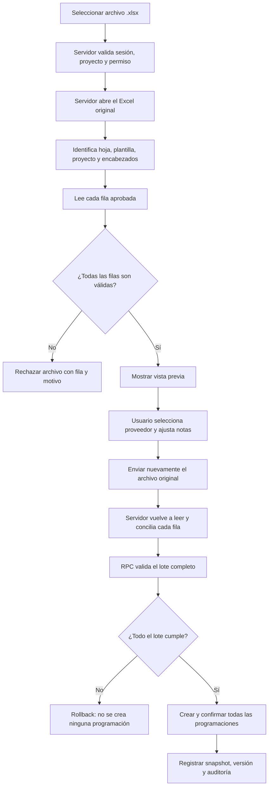

# Carga masiva de programaciones aprobadas desde Excel

## Objetivo

Este flujo importa solicitudes de concreto de **Mixto Listo** que ya fueron aprobadas dentro del mismo archivo Excel. Cada fila válida crea una programación independiente, en unidad `M3`, y la deja directamente en estado **Confirmada** y lista para el proceso de despacho.

No se utiliza OCR. El sistema procesa el archivo `.xlsx` original y no toma la información oficial desde campos editables del navegador.

## Flujo completo

La operación es **atómica**: si falla una fila, no se acepta ninguna programación del lote.

## Acceso y seguridad

Para previsualizar e importar se valida en el servidor:

- sesión y perfil activos;
- proyecto activo del usuario;
- permiso `programming.create` para ese proyecto;
- pertenencia del Excel al proyecto activo;
- proveedor activo y asignado al proyecto;
- existencia de una unidad activa con código `M3`.

La interfaz no constituye la validación final. Al confirmar, el navegador envía nuevamente el archivo original y el servidor lo vuelve a procesar. De esta forma, una modificación manual del JSON o de los controles del navegador no puede cambiar fecha, hora, pedido, tipo de concreto ni volumen.

## Archivo y plantilla admitidos

| Regla | Validación |
|---|---|
| Formato | Archivo `.xlsx` |
| Tamaño | Mayor que 0 y máximo 10 MiB |
| Libro | Debe ser legible por ExcelJS |
| Hoja | Nombre que identifique una solicitud y contenido con las firmas de Mixto Listo |
| Proyecto | Destinatario y dirección deben corresponder al proyecto activo según las reglas de referencia existentes |
| Encabezados | Pueden estar distribuidos en dos filas consecutivas |

La detección no depende de que la hoja se llame exactamente `Solicitud de Concreto`; reconoce variantes como las usadas en los archivos reales de Mixto Listo.

### Comparación de dirección

La dirección se compara por componentes y no exige que ambas redacciones sean idénticas. Las expresiones `Municipio de`, `Departamento de` y `Ciudad` se consideran etiquetas administrativas; también se reconocen ordinales equivalentes como `9 Calle` y `9a. Calle`. La nomenclatura, zona y demás números continúan siendo componentes críticos: por ejemplo, `5A-62` no se acepta como equivalente a `5A-63`.

## Columnas reconocidas

La plantilla debe permitir identificar:

- `Fecha de Fundición` y `Hora`, como firma de la solicitud original;
- `Tipo de concreto`;
- `Volumen (m3)`;
- `Elemento a fundir`;
- `Adiciones al concreto`;
- `DÍA PROGRAMADO`;
- `HORA PROGRAMADA`;
- `Pedido No.`.

`Pedido No.` es la columna oficial de aprobación. No debe confundirse con `No. De pedido`, aunque ambas aparezcan en la plantilla.

`Tiempo entre camiones` se conserva cuando la plantilla lo contiene, pero es opcional para aceptar una fila.

## Fuente oficial de cada programación

| Campo guardado | Fuente del Excel | Regla |
|---|---|---|
| Fecha programada | `DÍA PROGRAMADO` | Obligatoria y válida |
| Hora programada | `HORA PROGRAMADA` | Obligatoria y válida |
| Número de pedido | `Pedido No.` | Obligatorio |
| Tipo de concreto | `Tipo de concreto` | Obligatorio |
| Cantidad | `Volumen (m3)` | Numérica, finita y mayor que 0 |
| Unidad | Catálogo `M3` | Obligatoria y activa |
| Elemento | `Elemento a fundir` | Obligatorio |
| Adiciones | `Adiciones al concreto` | Opcionales |
| Intervalo | `Tiempo entre camiones` | Opcional |

`Fecha de Fundición`, `Hora` y `No. De pedido` no sustituyen los tres campos oficiales de aprobación. `Pedido No.` se conserva como texto de extremo a extremo, incluyendo ceros visibles y sufijos alfanuméricos.

## Reglas por fila

Cada fila se procesa de manera independiente, pero el lote se acepta o rechaza completo. Una fila es válida únicamente si:

1. tiene día y hora programados;
2. ambos forman una fecha real;
3. el día programado sea igual o posterior al día actual del proyecto;
4. tiene `Pedido No.`;
5. tiene tipo de concreto;
6. el volumen es mayor que cero;
7. tiene elemento a fundir;
8. existe el proveedor seleccionado y continúa autorizado para el proyecto;
9. existe la unidad activa `M3`.

Los errores indican la fila original del Excel para facilitar su corrección. Tres filas vacías consecutivas después de haber encontrado datos terminan la lectura, y los encabezados repetidos dentro del cuerpo no se importan.

## Vista previa

Los campos provenientes del Excel se muestran como solo lectura:

- día y hora programados;
- número de pedido;
- tipo de concreto;
- volumen y unidad;
- elemento;
- adiciones;
- intervalo.

Solo se permite ajustar:

- proveedor;
- notas internas.

Las notas iniciales se forman con el elemento, las adiciones cuando existan y el intervalo cuando exista. El número de pedido y el tipo de concreto no se duplican en las notas porque se almacenan en campos estructurados.

## Persistencia y confirmación

La migración `100_approved_programming_workbook.sql` agrega campos anulables para no romper los registros históricos:

- `programming.order_number`;
- `programming_lines.concrete_type`;
- `programming_revisions.order_number`;
- `programming_revision_lines.concrete_type`.

Cuando el lote es aceptado, cada programación:

- se crea con su pedido y línea de producto;
- queda en estado `CONFIRMED`;
- registra `confirmed_at` y `confirmed_by`;
- incrementa su versión mediante la misma lógica central de confirmación;
- genera snapshot de revisión;
- genera evento de auditoría con origen `APPROVED_MIXTO_WORKBOOK`.

La función de base de datos valida el lote completo antes de insertar y se ejecuta dentro de una sola transacción. Un error provoca rollback total.

La migración `101_approved_programming_same_day.sql` permite que una carga aprobada confirme una hora anterior del día actual. La comparación utiliza el día local y la zona horaria del proyecto. El flujo manual conserva la regla anterior que impide confirmar una hora ya pasada.

## Creación manual

El formulario **Nueva programación** también requiere:

- número de pedido en la programación;
- tipo de concreto en cada línea.

La creación manual conserva su comportamiento: inicia en `PENDING_CONFIRMATION` y debe confirmarse posteriormente. Al confirmar, la base de datos vuelve a exigir pedido y tipo de concreto.

## Uso en Despachos

Los campos estructurados se reutilizan en el flujo siguiente:

- el número de pedido se muestra en el detalle y se copia al crear el despacho;
- los tipos de concreto se muestran en el detalle del despacho;
- al abrir **Agregar guía**, la descripción del primer producto se precarga con el tipo de concreto;
- el código del producto continúa siendo opcional.

Para registros históricos con valores `NULL`, la interfaz muestra `—`.

## Riesgo conocido: reintentos

El sistema no dispone actualmente de una llave de idempotencia para esta importación. Si una respuesta exitosa se pierde y el usuario vuelve a enviar el mismo archivo, podrían crearse duplicados. No se inventó una regla de deduplicación porque el requerimiento no define una clave de negocio única segura.

Antes de reintentar una carga cuyo resultado sea incierto, debe verificarse en Programación si el lote ya fue creado.

## Despliegue en PROD

La aplicación y Supabase deben desplegarse en conjunto. El orden recomendado es:

1. verificar que el proyecto enlazado sea el Supabase de PROD;
2. aplicar las migraciones pendientes en orden; `100_approved_programming_workbook.sql` y después `101_approved_programming_same_day.sql`;
3. verificar que la migración aparezca tanto local como remota;
4. desplegar la aplicación;
5. realizar una prueba controlada, incluyendo una hora anterior del día actual y el rechazo de un día anterior.

La migración modifica esquema y funciones; no elimina ni limpia datos existentes.
